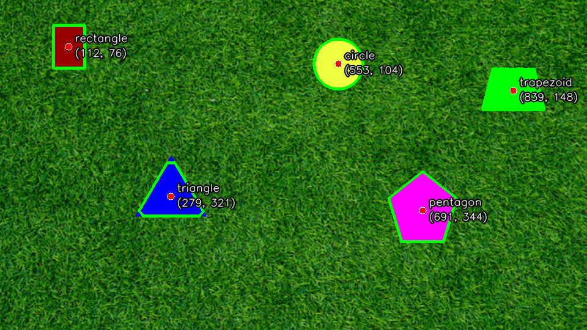
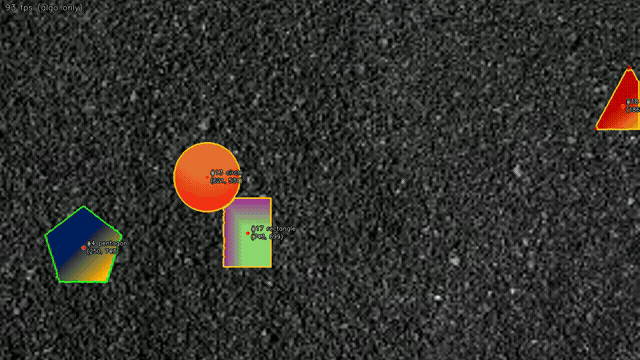
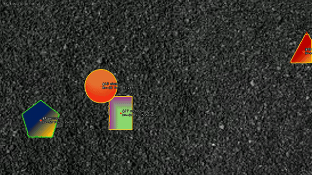

# PennAir 2024 Application Challenge – Shape Detection

Detects solid shapes on a textured background, traces their outlines, marks their
centres, and (Part 4) estimates their 3D position from the camera. Plain OpenCV +
NumPy, no pretrained models.

| Part | What | Result |
|---|---|---|
| 1 | Static image | [`results/static_result.png`](results/static_result.png) |
| 2 | Video, streamed frame by frame | [`results/part2_dynamic.mp4`](results/part2_dynamic.mp4) |
| 3 | Background agnostic ("Hard" video) | [`results/part3_dynamic_hard.mp4`](results/part3_dynamic_hard.mp4) |
| 4 | 3D centres (X, Y, Z in inches) | [`results/part4_dynamic_3d.mp4`](results/part4_dynamic_3d.mp4), [`results/part4_dynamic_hard_3d.mp4`](results/part4_dynamic_hard_3d.mp4) |
| 5 | ROS2 nodes + launch file | [`ros2_ws/`](ros2_ws/) |

The write-up (approach, challenges, what was changed for speed / robustness) is in
[`docs/REPORT.md`](docs/REPORT.md).

## Quick look

**Part 1** – static image



**Part 2** – grass video (12 s excerpt, full video linked above)


**Part 3** – gravel background + gradient-filled shapes, same code, no retuning



**Part 4** – X/Y/Z in inches relative to the camera (depth from the 10 in circle)



Green outline = shape fully visible on its own, orange outline = shape
touching/overlapping another one or cut off by the frame edge (its outline and
label are less trustworthy in that frame).

## How it works (short version)

Every background in this challenge is *textured* (grass, gravel) while the shapes
are flat or smoothly shaded. So the detector doesn't look for colours at all, it
looks for **patches that are locally smooth**:

1. downscale to 960 px wide
2. texture map = 9×9 box-mean of |Laplacian| (after a σ=1 Gaussian to kill codec noise).
   A colour gradient has ~zero second derivative, so gradient-filled shapes still read as smooth.
3. threshold at 0.3 × the frame's median texture (the median is basically "how textured is the background", so this self-tunes per frame)
4. open/close to clean up → blobs
5. watershed seeded from the blobs to snap the outline back onto the real edge
6. contours → centre (moments), rough label (polygon approximation), occlusion flag

Video adds a tiny constant-velocity tracker for stable IDs, and Part 4 turns the
circle's pixel radius into depth (`Z = f · 10 in / r_px`), then `X = u·Z/fx`, `Y = v·Z/fy`.

~11–14 ms per 1080p frame on a laptop (≈70–90 fps algorithm-only), so it keeps up
with the 30 fps videos with room to spare.

## Running it

```bash
python3 -m venv .venv && source .venv/bin/activate
pip install -r requirements.txt

# Part 1
python detect_image.py "PennAir 2024 App Static.png" -o results/static_result.png

# Part 2 / 3  (add --show for a live window, q to quit)
python detect_video.py "PennAir 2024 App Dynamic.mp4"      -o results/part2_dynamic.mp4
python detect_video.py "PennAir 2024 App Dynamic Hard.mp4" -o results/part3_dynamic_hard.mp4

# Part 4
python detect_video.py "PennAir 2024 App Dynamic Hard.mp4" --3d -o results/part4_dynamic_hard_3d.mp4

# sanity tests
python tests/test_detector.py
```

`detect_video.py` reads frames one at a time and never looks ahead, so it behaves
like a live camera feed. The videos it writes are raw `mp4v`; the ones in
`results/` were re-encoded to H.264 with ffmpeg so they play in a browser.

## Part 5 – ROS2

Two nodes and a launch file live in `ros2_ws/src`:

- `pennair_shapes_msgs` – `ShapeDetection` / `ShapeDetectionArray` messages (id, label, pixel centre, 3D position, outline polygon)
- `pennair_shapes`
  - `video_publisher` – streams a video file as `sensor_msgs/Image` on `camera/image_raw`
  - `detector_node` – runs the same `shape_detector` package on each image, publishes `shapes/detections` and an annotated image on `shapes/image_annotated`
  - `launch/shapes.launch.py` – runs both

```bash
# Ubuntu 24.04 + ROS 2 Jazzy (macOS: Ubuntu VM via UTM)
sudo apt install ros-jazzy-cv-bridge python3-opencv python3-numpy
cd ros2_ws
colcon build --symlink-install
source install/setup.bash
ros2 launch pennair_shapes shapes.launch.py video:=/abs/path/PennAir\ 2024\ App\ Dynamic\ Hard.mp4 use_3d:=true

# in another terminal
ros2 topic echo /shapes/detections
ros2 run rqt_image_view rqt_image_view /shapes/image_annotated
```

The ROS package pulls in the algorithm through a symlink
(`ros2_ws/src/pennair_shapes/shape_detector → ../../../shape_detector`), so the
nodes run exactly the same code as the scripts above.

> Written against the ROS 2 Jazzy docs; this was developed on macOS without a ROS
> install, so the package hasn't been built here yet.

## Layout

```
shape_detector/     the algorithm (detector, tracker, 3D geometry, drawing)
detect_image.py     Part 1 CLI
detect_video.py     Parts 2–4 CLI
tests/              sanity tests
results/            processed image / videos / gifs
docs/REPORT.md      write-up
ros2_ws/            Part 5
```

Note: `PennAir 2024 App Dynamic.mp4` is 102 MB, over GitHub's file limit, so it's
git-ignored (grab it from the challenge doc or use Git LFS). The other inputs are
tracked.
