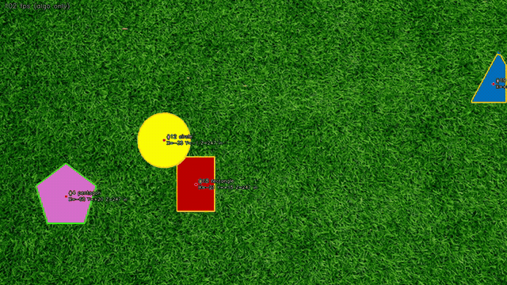
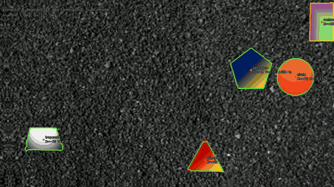
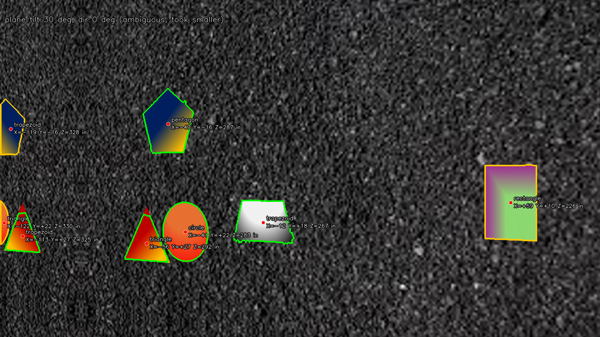

# PennAir 2024 Application – Shape Detection

This is my PennAir application challenge submission. It detects solid shapes on a
textured background, traces their outlines, marks their centres, and estimates
their 3D position relative to the camera. Plain OpenCV + NumPy, no pretrained
models. Parts 1–5 are done; for Part 6 the 3D estimate is extended to a tilted
camera (ground-plane normal from the circle's ellipse).

## Results

**Part 1 – static image**


**Part 2 – video (grass)** · full video: [`results/part2_dynamic.mp4`](results/part2_dynamic.mp4)


**Part 3 – background agnostic (gravel + gradient-filled shapes)** · full video: [`results/part3_dynamic_hard.mp4`](results/part3_dynamic_hard.mp4)


**Part 4 – 3D positions (X, Y, Z in inches)** · full videos: [`results/part4_dynamic_hard_3d.mp4`](results/part4_dynamic_hard_3d.mp4), [`results/part4_dynamic_3d.mp4`](results/part4_dynamic_3d.mp4)




**Part 6 – tilted camera (synthetic tilt sweeping 0→35°, estimate vs. truth in the top-left)** · full video: [`results/part6_tilt_demo.mp4`](results/part6_tilt_demo.mp4)



Green outline = shape fully visible on its own. Orange outline = shape
touching/overlapping another one or cut off by the frame edge (its outline and
label are less trustworthy in that frame). The fps counter is algorithm time
only, on an M1 laptop.

## Part 2 – video

**Approach.** The detector doesn't look for colours at all. Every background in
the challenge is *textured* (grass, gravel) while the shapes are flat or smoothly
shaded, so it looks for patches that are locally smooth:

1. downscale to 960 px wide
2. texture map = 9×9 box-mean of |Laplacian| (after a σ=1 Gaussian to kill codec noise)
3. threshold at 0.3 × the frame's median texture. The median is basically "how textured is the background", so this self-tunes every frame
4. open/close to clean up → blobs
5. the blobs come out eroded by ~6 px because the texture window straddles the edge, so they're used as watershed markers and the watershed grows them back out to the real edge
6. contours → centre (moments), rough label (polygon approximation), occlusion flag

`detect_video.py` pulls frames with `cap.read()` one at a time and never seeks
or looks ahead, so the algorithm is the same one-frame function as Part 1 plus
a small tracker that only remembers the past.

**Performance and adjustments.** The first working version ran at ~30 ms/frame,
right at the 30 fps budget with no margin. What changed:

| change | ms/frame |
|---|---|
| float32 texture map, numpy channel sum | ~30 |
| uint8/int16 pipeline, `cv2.transform` for the channel mean | ~16 |
| histogram median instead of `np.median` (3 ms → 0.3 ms), separable (rectangular) dilation kernel | ~11–14 |

Everything runs at 960×540 and contours are scaled back to 1080p, which costs
essentially nothing in outline accuracy. 640 px wide gives ~8 ms if it ever had
to run on a weaker board.

**Consistency across frames.** Shapes move ~30 px/frame (up to ~120 px), so a
plain nearest-neighbour tracker mixed up IDs when shapes crossed. Two fixes:

- constant-velocity prediction: new detections are matched against where each track *should* be, and missing tracks coast along their velocity for a few frames
- labels come from a majority vote over the last ~30 frames, and frames where the shape is touching another shape or cut off by the frame edge don't vote. A half-hidden pentagon looks like a trapezoid and a circle sliding in from the edge looks like a D; this stops them from being misnamed

**Overlap.** When two shapes overlap, the colour edge between them shows up in
the texture map, so the watershed naturally splits them into two regions with a
shared border. That's why overlapping shapes still get separate outlines and
centres (drawn in orange). The occluded shape's centre is the centroid of its
*visible* part, so it drifts toward the visible side; proper occlusion handling
would need per-shape models (Part 6 territory).

## Part 3 – background agnostic

Nothing background-specific was ever in the code, so the same script runs on
the "Hard" video with zero parameter changes. Getting there did take a few
modifications:

- **Gradient-filled shapes.** The first texture measure was local standard deviation, which flags a steep colour gradient (the navy→yellow pentagon) as texture. Switching to the Laplacian fixed it: a linear ramp has zero second derivative no matter how steep it is, while gravel and grass have a lot.
- **Codec noise inside gradients.** H.264 gradients aren't perfectly linear (banding), which leaked through at the fine scale. A σ=1 Gaussian before the Laplacian and a 9×9 mean after it were enough.
- **Low-contrast edges.** The white→grey trapezoid's bottom edge is nearly the same brightness as the dark gravel and the watershed occasionally wanders a few pixels there. Limiting how far it may grow (a ~9 px band around each blob) keeps that bounded.
- **Plain-colour backgrounds.** Not in the test data, but "agnostic" should cover it: if the frame's median texture is near zero the texture trick has nothing to work with, so the detector falls back to "differs from the dominant colour". Covered by `tests/test_detector.py`.
- **Edge artefact.** The hard video has a thin smooth strip at its right edge which showed up as a false positive; a min-area and solidity (area / convex-hull area) filter removed it.

## Part 4 – 3D

Intrinsics from the prompt: `fx = 2564.32`, `fy = 2569.70`, `cx = cy = 0`.
`cx = cy = 0` is read as "pixel coordinates are measured from the image centre"
(that's also what the reference video shows), so `u = x − W/2`, `v = y − H/2`.

Depth comes from the circle, whose real radius is 10 in:

```
Z = fx · R / r_px          (r_px from cv2.minEnclosingCircle on the circle's contour)
X = u · Z / fx
Y = v · Z / fy
```

The surface is flat, so that one Z is applied to every shape. Z is smoothed
with an EMA and only updated from an *unoccluded, unclipped* circle (a
half-hidden circle has a bogus radius); when the circle is off-screen the last Z
is held. For these videos Z works out to ~246–247 in, about 20.5 ft, which is a
plausible camera height.

## Part 6 – 3D on a tilted plane

Part 4 assumes the camera looks straight down. An aircraft banks and pitches,
and then the circle is seen as an ellipse. So the circle's ellipse is used to
estimate the ground plane's normal, and every shape's (X, Y, Z) becomes the
intersection of its pixel ray with that plane instead of a fixed depth.
`detect_video.py --tilt` turns it on; the HUD shows the estimated tilt.

**How.** The obvious version ("axis ratio = cos(tilt), minor axis = tilt
direction") is 5–6° off here, because with a 2564 px focal length the circle
sits up to ~20° off-axis and perspective shear rotates the ellipse. So instead
the ellipse is modelled properly: its covariance is `A·S·Aᵀ`, with `A` the local
projection Jacobian at the circle's image position and `S` the circle's
covariance on the tilted plane. A vectorised grid search over the normal (2.6 ms)
finds the best match, and the ellipse size then gives the circle's depth.

**Ambiguity.** Pose from a single circle has two solutions (the two circular
sections of the back-projected cone). On-axis they're "tilted toward" vs.
"away"; off-axis the partner has a larger tilt in ~the opposite direction. Both
are enumerated; an external direction hint (the aircraft's IMU) picks one,
otherwise the smaller tilt is taken and the HUD says "ambiguous". Above ~30°
the wrong one fits visibly worse and drops out on its own.

**Two things discovered on the way.** The challenge's circle asset is actually
~4% taller than wide (bbox 199×207 px, square pixels), which read as a 16° tilt
until it was modelled as an ellipse on the plane. And the circle classifier had
to change from circularity to "how far are the contour points from their
best-fit ellipse", because a foreshortened circle is not circular.

**Testing.** The given videos are top-down, so tilted frames are synthesised:
take a clean frame, and warp it with the exact homography of a camera orbiting
around the ground point on its optical axis (`H = K (R + t nᵀ/d) K⁻¹`). The
true normal and every shape's true 3D position are then known.
`tools/tilt_benchmark.py` runs it; `tests/test_tilt.py` asserts on it.

| true tilt | axis | est. tilt | dir err | solutions | 3D err, tilt model | 3D err, flat (Part 4) model |
|---|---|---|---|---|---|---|
| 0° | 90° | 0.0° | 0.0° | n/a | 0.4 in | 0.0 in |
| 10° | 90° | 10.0° | 0.0° | 1 | 0.1 in | 6.2 in |
| 20° | 90° | 20.0° | 0.0° | 2, took smaller | 0.8 in | 12.3 in |
| 30° | 90° | 30.0° | 0.0° | 2, took smaller | 0.6 in | 17.9 in |
| 40° | 90° | 41.0° | 0.0° | 2, took smaller | 1.1 in | 22.9 in |
| 10° | 0° | 11.0° | 0.0° | 2, took smaller | 0.8 in | 6.6 in |
| 20° | 0° | 21.0° | 0.0° | 2, took smaller | 1.0 in | 10.1 in |
| 30° | 0° | 31.0° | 0.0° | 2, took smaller | 1.3 in | 11.9 in |
| 40° | 0° | 41.0° | 0.0° | 2, took smaller | 1.5 in | 13.1 in |
| 25° | 45° | 25.0° | 0.0° | 2, took smaller | 0.8 in | 16.0 in |

(axis 90° = tilt about the image y axis, 0° = about x. 3D error is the mean
over the 5 shapes, in inches, at ~21 ft range.)



Limitations, stated plainly: tilts under ~8° are reported as flat (cos is flat
near 1, and the ellipse fit noise is ~0.2%); the asset's ellipticity is assumed
to lie along the camera's y axis (no yaw); and the two-fold ambiguity really
does need an IMU for large tilts in the "unexpected" direction.

---

Run instructions, the ROS2 (Part 5) package, and the repo layout are in
[`docs/RUNNING.md`](docs/RUNNING.md). The full write-up including Part 1
details is in [`docs/REPORT.md`](docs/REPORT.md).
